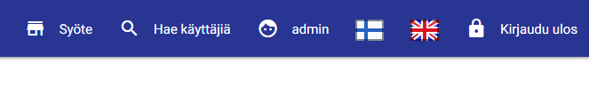
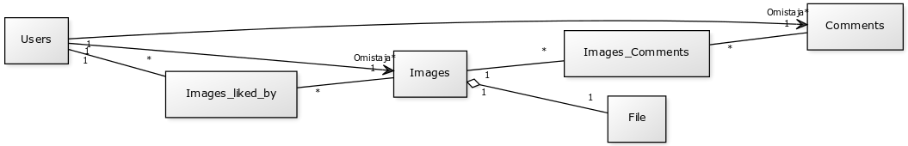

#Web-palvelinohjelmoinnin projekti 2016

Kurssin projektityönä on kuvapalvelu, johon käyttäjä voi lisätä kuvia.
Muut käyttäjät pystyvät kommentoimaan ja tykkäämään kuvista sekä selaamaan toisien profiileja.
Sivut on toteutettu responsiivisesti eli ne toimivat sekä selaimessa että mobiililaitteella hyvin.

Huomioitavaa on, että projekti ei vaadi JavaScript -tukea selaimelta, mutta se on vahvasti suositeltavaa.

Mobiililaitteilla sivuvalikko ei avaudu, jos JavaScript ei ole päällä (pohdimme tälle ratkaisua).

Muuten projekti on täysin toimiva. Kuvien lisäys, kuvien selaaminen, kuvien kommentointi 

ja kuvista tykkääminen toimivat ilman JavaScriptiä.

## Sovelluksen linkki: https://hummingbird-66191.herokuapp.com/

## Build status ja test coverage

 

## Toiminnallisuus

* Kuvien lataus
* Kuvien tykkäys ja kommentointi
* Käyttäjäprofiilit
* Rekisteröitymislomake
* Pääkäyttäjällä mahdollisuus poistaa kommentteja ja kuvia hallintasivun kautta
* Responsiivinen ulkoasu eli toimii hyvin sekä mobiililaitteilla että työpöytäselaimilla

## Käyttötapaukset

### 1. Käyttäjä kirjautuu sisään

Käyttäjän navigoidessa sovelluksen sivulle häntä kehotetaan kirjautumaan sisään.

### 2. Käyttäjä kirjautuu ulos

Riippuen siitä onko käyttäjällä JavaScript päällä vai ei, klikkaamalla

"Kirjaudu ulos" -nappia navigointipalkin oikeassa yläkulmassa ohjataan käyttäjä

uloskirjautumiseen. Jos JavaScript ei ole päällä, näytetään tämä sivu:

### 3. Käyttäjä haluaa selata kuvia

Etusivulla näytetään kymmenen uusinta kuvaa. Niitä voi tykätä ja niihin voi kommentoida.

Oletuksena kommenteista näytetään kolme uusinta ja klikkaamalla "Näytä kuvasivu ja loput kommentit" -linkkiä näytetään loput kommentit.

Kuvat ladataan asynkronisesti JavaScriptillä ja niissä hyödynnetään ETag -tunnistetta.

Jos JavaScript ei ole päällä, kuvat latautuvat normaalisti.

Lisäksi käyttäjä voi halutessaan klikata käyttäjien nimiä päästäkseen katsomaan heidän profiilejaan.

### 4. Käyttäjä haluaa jakaa kuvan

Klikkaamalla pyöreää, punaista  -nappia käyttäjälle näytetään kuvan jakamissivu.

Kuvan maksimikoko on 12 megatavua ja sallittuja tiedostomuotoja ovat .jpg, .jpeg, .png ja .gif .

Kuvalle annetaan otsikko ja valitaan sopiva kuvatiedosto.

Sen jälkeen painetaan  -nappia. Toiminnossa kestää hetki jonka jälkeen käyttäjä

ohjataan sovelluksen etusivulle. Ladattu kuva ilmestyy etusivulle.

### 5. Käyttäjä haluaa hakea muita käyttäjiä

Klikkaamalla "Haku" -nappia navigointipalkista aukeaa hakusivu.

Kenttään syötetään haluttu hakusana ja painetaan  -nappia.

Listaan alapuolelle ilmestyy hakusanaa vastaavat profiilit. Käyttäjätunnusta klikkaamalla pääsee selaamaan käyttäjän profiilia.

### 6. Käyttäjä selaa muun käyttäjän profiilia

Käyttäjä voi selata muun käyttäjän profiilia esim. menemällä "Haku" -sivulle tai klikkaamalla

kommenteissa tai kuvissa olevia käyttäjätunnuslinkkiä.

Kuvat järjestetään oletuksena Masonry jQuery -kirjastolla "korttimosaiikiksi".

Profiilisivulla on sama toiminnallisuus kuin "Syöte" -sivulla; kuvista pystyy tykkäämään ja niitä pystyy kommentoimaan.
Lisäksi on mahdollisuus avata yksittäisen kuvan kuvasivu.

### 7. Käyttäjä haluaa kommentoida kuvaa

Käyttäjä voi kommentoida kuvaa suoraan klikkaamalla "Kommentoi" -linkkiä kuvakortin alapuolella:

### 7. Käyttäjä haluaa tykätä kuvasta

Käyttäjä voi tykätä suoraan klikkaamalla "Tykkää" -linkkiä kuvakortin alapuolella:

### 8. Käyttäjä haluaa vaihtaa sovelluksen kielen

Käyttäjä voi vaihtaa sovelluksen kielen klikkaamalla yläpalkin oikeassa yläkulmassa olevia lippuja:

### 9. Pääkäyttäjä haluaa poistaa kuvan tai yksittäisen kommentin

Sovelluksessa on toiminnallisuus, jolla pystyy "poistamaan" yksittäisiä kuvia ja kommentteja.
Ollessa kirjautuneena pääkäyttäjätunnuksella käyttäjä näkee kuvan alla "Poista kuva" -napin sekä kommentin alla vastaavasti "Poista kommentti" -napin. 
Nappia painamalla kommentti/kuva poistetaan:

## Tietokantataulut

* Käyttäjät -taulu (id (integer), email (varchar), password (varchar), role (varchar), username (varchar))
* Kommentit -taulu (id (integer), body (varchar), timestamp (timestamp), visible (boolean), FK user_id (integer))
* Kuvat -taulu (id (integer), content_type (varchar), timestamp (timestamp), description (varchar), uuid (varchar), visible (boolean), FK file_id (integer), FK image_owner_id (integer))
* Kuvan data -taulu (id (integer), file (byte))
* Kuvan tykkäykset -liitostaulu (FK image_id (integer), FK liked_by_id (integer))
* Kuvan kommentit -liitostaulu (FK image_id (integer), FK comments_id (integer))

## Testaus

* Yksikkö- ja integraatiotestit jne.
* GitHub -> Travis -> Heroku

## Toteutetut ominaisuudet:

* Kuvien lataus
* Kuvien tykkäys ja kommentointi
* Käyttäjäprofiilit
* Rekisteröitymislomake
* Responsiivinen ulkoasu eli toimii hyvin sekä mobiililaitteilla että työpöytäselaimilla
* Lokalisointi (Suomi / Englanti)
* Pääkäyttäjätoiminnallisuus

## Toteuttamatta jääneet:

* "Restful" -rajapinta käyttäjätilien hakuun. Itse kontrolleri on tehty, mutta sitä ei ole kytketty hakulomakkeeseen. Haku olisi suoritettu jQueryn autocomplete -ominaisuudella.

GET -pyyntö osoitteeseen http://localhost:8080/api/users/{hakusana}

esimerkiksi http://localhost:8080/api/users/us palauttaa: [{"username":"user"}] ja http://localhost:8080/api/users/a palauttaa: [{"username":"admin"}]

## NetBeansin liitännäisellä luotu luokkakaavio:

## Tietokantakaavio:

